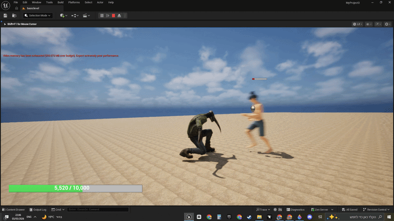
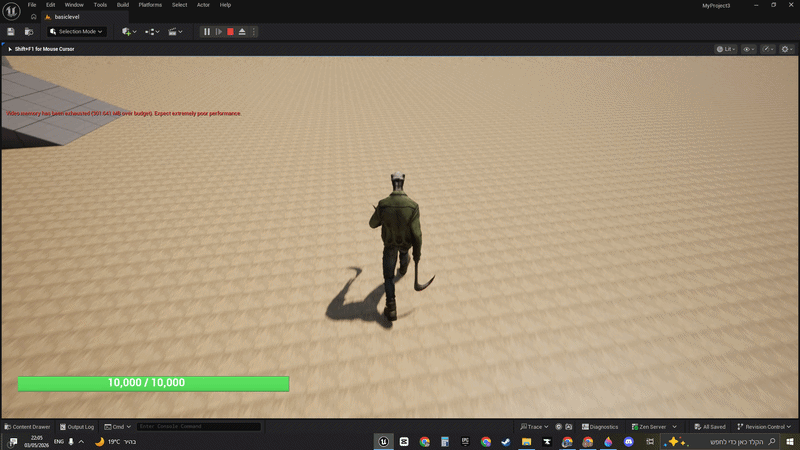
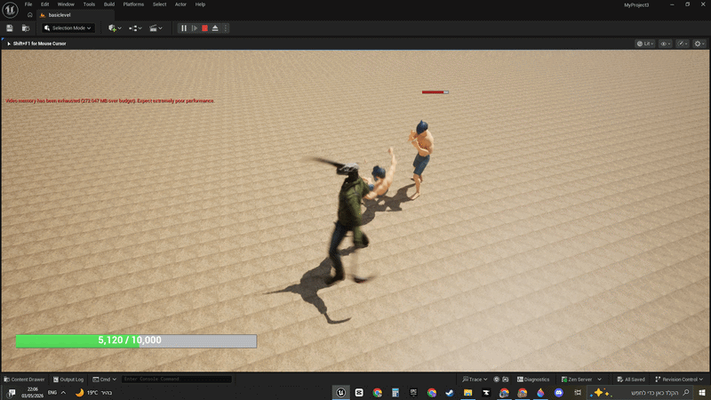

#  TheScythe: Hybrid Combat System
### **Unreal Engine 5 | Advanced Character Mechanics & AI Prototype**

Welcome to the abyss. **TheScythe** is a high-octane action prototype developed in Unreal Engine 5, focusing on a complex "Scythe-Hybrid" character. This project showcases advanced blueprint logic, multi-layered movement systems, and intelligent NPC combat behaviors.

---

##  Core Mechanics: The Scythe-Hybrid
As a Hybrid entity, the player isn't just a tank with **10,000 HP**—they are a precision instrument of destruction.

*   **Adaptive Health System:** Custom Damage Logic and real-time HP bar synchronization.
*   **The Abyssal Charge (Right-Click):**
    *   **Phase 1:** Charging state with procedural Screen Shake.
    *   **Phase 2 (The Mark):** A dynamic UI system scans the target.
        *    **Skull with X:** Target exceeds execution threshold.
        *    **Pure Skull:** Target is ready for the end.
    *   **Phase 3 (Blink Execution):** After a 2-second charge, the player teleports behind the opponent, dealing massive, scaled damage.
*   

---

##  Kinetic Movement Gimmick
The movement isn't just "WASD". It’s a layered system designed for flow:
*   **State 1 (Walk):** Precision movement.
*   **State 2 (Run):** Standard traversal.
*   **State 3 (Fast Run):** Activated via a **"Tap then Hold"** Shift key mechanic. This requires specific input-buffer logic to differentiate between a tap and a sustained sprint.
*   

---

##  Enemy AI & Combat Logic
The enemies in this world are relentless. They hunt, they don't just follow.
*   **Seek & Destroy:** NPCs use constant pursuit logic to close the gap with the player.
*   **Proximity-Based Combat:** 
    *   Once the player is within a specific radius, the AI triggers an **Attack Animation**.
    *   **Hitbox Verification:** Frame-perfect collision system. If the weapon connects, damage logic is applied.
*   **Death States:** Transition logic where enemies become static corpses upon health depletion.
*   

---

##  Technical Highlights
*   **Engine:** Unreal Engine 5.3+
*   **Physics:** Custom Hitbox Collision & Trace-based damage.
*   **UI/UX:** Dynamic progress bars and conditional icon rendering based on health states.

---
> Developed by **ZivDevelop** - Focusing on combat systems and AI.
